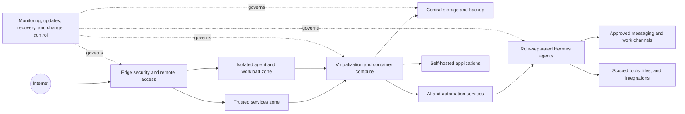

# Homelab Portfolio

**A sanitized engineering portfolio for the self-hosted infrastructure, automation, and AI-agent systems I operate.**

This repository explains the architecture, operating practices, and technical decisions behind my home lab without publishing live addresses, routes, credentials, administrative endpoints, or a complete attack-surface inventory.

> **Disclosure boundary:** this is an engineering portfolio, not a live network map. Names, quantities, placement, and connectivity are intentionally generalized.

## What the lab demonstrates

| Layer | Representative technologies | Engineering focus |
| --- | --- | --- |
| Edge and access | OPNsense, managed switching, mesh Wi-Fi, Tailscale, Cloudflare, Caddy | Segmentation, encrypted remote access, DNS, TLS, and controlled exposure |
| Compute | Proxmox VE, Linux virtual machines, Docker/Compose, GPU passthrough | Workload placement, isolation, capacity planning, and recoverability |
| Storage | TrueNAS SCALE, SMB-backed workloads, snapshots, independent backups | Data ownership, permissions, lifecycle management, and restore planning |
| AI and automation | Hermes Agent, Ollama, Open WebUI, SearXNG, Firecrawl, n8n | Role-separated agents, local/cloud model routing, research, and scheduled workflows |
| Applications | Home automation, media, DNS filtering, dashboards, document services, game services | Service integration, health checks, maintenance, and user-facing reliability |
| Operations | Git, scripted checks, monitoring, UPS-aware shutdown, change records | Repeatable updates, evidence-based verification, rollback, and incident response |

## Conceptual architecture



The important part is not the number of applications. It is operating them as one system: deciding where they belong, limiting what they can reach, preserving state, updating without unnecessary downtime, and proving that recovery paths work.

## How I operate it

1. **Discover before changing** — inventory the current state, dependencies, and failure domain.
2. **Protect state** — take the appropriate configuration backup, snapshot, or rollback point.
3. **Change narrowly** — update one layer or workload class at a time.
4. **Verify every hop** — check the service, its dependencies, network path, storage path, and user-facing behavior.
5. **Record evidence** — preserve what changed, what was tested, and what remains unresolved.
6. **Recover deliberately** — use tested rollback and restore procedures instead of improvising under pressure.

More detail:

- [Conceptual architecture](docs/ARCHITECTURE.md)
- [Public service map](docs/PUBLIC-SERVICE-MAP.md)
- [Operations and update lifecycle](docs/OPERATIONS.md)
- [Security and disclosure policy](SECURITY.md)

## Hermes agent environment

The lab includes multiple Hermes Agent instances with separate roles, identities, workspaces, communication routes, and permission boundaries. Depending on the role, an agent may use scheduled workflows, durable memory, approved file stores, research tools, local AI services, or narrowly scoped external integrations.

The public design principle is simple:

```text
Untrusted input
  → bounded intake or specialist surface
  → explicit policy / approval boundary
  → narrowly scoped action
  → evidence returned to the owner
```

Privileged agents are not exposed as public chatbots, and public documentation does not include bot identities, channel identifiers, tokens, internal routes, or administrative URLs.

## Related public projects

- [Presence Stack](https://github.com/whosebruce/presence-stack) — privacy-first, agent-readable deployment harness for an owner-controlled digital presence.
- [Local-First AI Receptionist](https://github.com/whosebruce/local-first-ai-receptionist) — tiered intake with explicit trust boundaries and offline security verification.
- [Hermes Discord Admin Pack](https://github.com/whosebruce/hermes-discord-admin-pack) — sanitized setup and extension guide for Hermes Discord administration.
- [Bruce Mission Control](https://github.com/whosebruce/bruce-mission-control) — an operational dashboard for a multi-agent environment.

## What is intentionally absent

This repository does **not** contain:

- IP addresses, hostnames, domains, VLAN identifiers, ports, or VPN routes;
- exact physical topology or a complete list of running services;
- firewall, reverse-proxy, tunnel, or identity-provider configuration;
- credentials, tokens, account identifiers, recovery material, or private paths;
- live Compose files, environment files, backups, logs, or screenshots of administrative interfaces.

That omission is part of the design. A portfolio should demonstrate engineering judgment without making the real environment easier to target.

## Repository verification

```bash
python3 -m unittest discover -s tests -v
python3 scripts/privacy_scan.py
```

The scanner checks the working tree, exact Git index, and reachable history for common secret and infrastructure indicators. Operator-specific markers can be added locally through a gitignored `local-patterns.txt` file.

## License

MIT. See [LICENSE](LICENSE).
