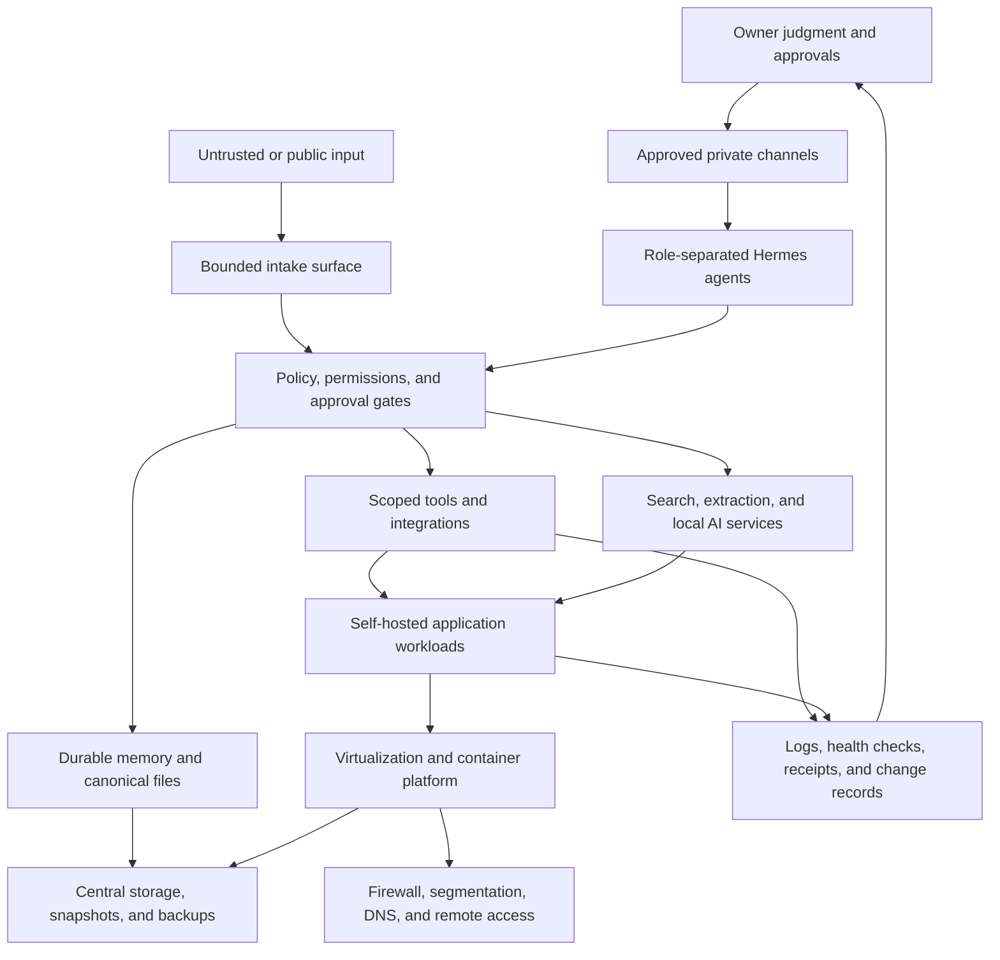

# Conceptual Architecture

This document describes capability boundaries, not the live physical or logical topology.

## Layered view

## Boundary decisions

### Edge and remote access

- The firewall is the policy enforcement point rather than individual applications improvising their own exposure rules.
- Administrative surfaces remain private and use encrypted remote-access paths.
- Publicly reachable workloads are treated differently from trusted management workloads.
- DNS, certificates, reverse proxies, and tunnels are verified as separate hops.

### Compute

- Proxmox provides workload separation, snapshot boundaries, hardware passthrough, and recovery options.
- Linux virtual machines and containers are selected according to state, risk, hardware access, and operational complexity.
- High-risk or externally influenced workloads are separated from trusted management and personal-data paths.

### Storage

- Stateful data belongs on intentionally managed storage rather than inside disposable containers.
- Applications receive only the shares and permissions they need.
- Snapshots protect against some mistakes; independent backups and tested restores address different failure modes.
- Storage availability is verified before dependent application stacks start or recover.

### AI agents

- Agent identity, authority, memory, tools, and communication routes are separate design decisions.
- Specialist agents receive narrower capabilities than the primary owner agent.
- Public or unknown users do not enter a full-power private session.
- High-impact actions require explicit authority and return evidence after execution.

### Local and hosted AI

- Hosted models handle complex orchestration when that is the best reliability/capability tradeoff.
- Local GPU services support selected inference, speech, research, and privacy-sensitive workloads.
- Model placement is based on measured memory, context, concurrency, and recovery behavior—not labels alone.

## Failure domains considered

- ISP or public-edge outage
- firewall, switch, or wireless failure
- hypervisor or individual virtual-machine failure
- storage unavailable during application startup
- GPU or model-service capacity pressure
- certificate, DNS, proxy, or tunnel failure
- credential revocation or identity-provider failure
- duplicate messaging consumers or conflicting agent gateways
- unsafe update, partial migration, or failed reboot

The live implementation changes over time. The durable engineering value is preserving clear boundaries and verification paths while it changes.
