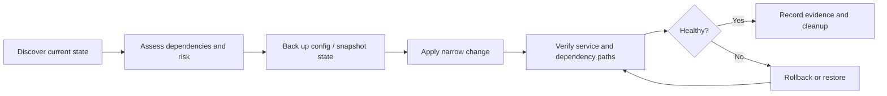

# Operations and Update Lifecycle

The lab is treated as a small production environment: changes are scoped, state is protected, and completion requires evidence.

## Standard maintenance loop

## Discovery

Before updating a host or service:

- identify the authoritative configuration and data location;
- check dependency health, storage availability, and network path;
- distinguish operating-system, container-image, application, model, and firmware updates;
- identify whether a reboot or migration will affect other workloads;
- decide what evidence will prove success.

## Protection

The protection method matches the failure domain:

- configuration export for network and appliance changes;
- virtual-machine snapshot for bounded system changes;
- application/database backup for stateful services;
- independent copy for data that must survive pool or host loss;
- documented rollback for network changes that could remove management access.

A snapshot is not treated as a complete backup, and a successful backup job is not treated as a successful restore test.

## Change execution

- Change the smallest useful scope.
- Preserve working local configuration unless a migration explicitly replaces it.
- Stage risky changes on non-critical workloads where possible.
- Keep trusted management and rollback paths available.
- Avoid simultaneous updates that erase the ability to identify the failing layer.

## Verification

Verification is layered rather than relying on a green process status:

1. process, container, or virtual machine is running;
2. expected local endpoint responds;
3. upstream storage, database, model, or network dependency responds;
4. proxy, DNS, certificate, tunnel, or messaging path works where applicable;
5. the real user workflow succeeds;
6. logs do not show a new repeating failure;
7. rollback material and temporary artifacts are accounted for.

## Agent operations

Agent updates preserve identity, authorization boundaries, channel ownership, memory, and local configuration. Multi-agent environments also require checks for:

- duplicate consumers using one messaging identity;
- one profile reading another profile's private state;
- tools or credentials broader than the assigned role;
- scheduled tasks delivering to the wrong channel;
- actions reported as complete without external evidence.

## Incident response pattern

1. Establish a timeline from logs and observed symptoms.
2. Separate infrastructure failure from suspected compromise.
3. Preserve evidence before cleanup or destructive repair.
4. Restore the narrowest failed dependency first.
5. Verify downstream services in dependency order.
6. Record remaining risk and follow-up work honestly.

This operating discipline is the main project. The individual applications are replaceable components inside it.
